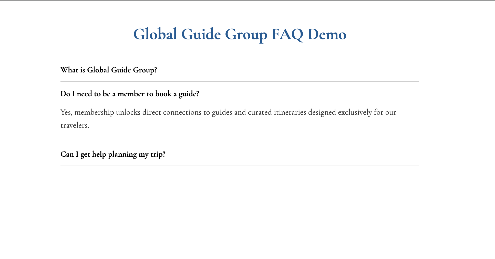

# wix-faq-accordion

[](https://wialtd.github.io/wix-faq-accordion/)
[]()
[]()
[]()


Custom FAQ accordion for Wix Studio sites, used in **GlobalGuideGroup.com** to replace the
default Wix FAQ widget, which is limited in functionality and has consistently poor line-spacing and thus poor visual appeal.

This project provides a **clean, collapsible FAQ** with smooth animations and support for multiple questions, all fully controllable from Wix Dev Mode.

---
## 📸 Visual Demo



*Above: Example of the custom FAQ accordion in action.*

---

## Features

- Smooth expand/collapse animations  
- Automatically collapses other questions when a new one is opened  
- Scrolls to the active question for better UX  
- Uses simple JS + Wix `$w` selectors (no external libraries)

---

## How to Use

1. **Enable Dev Mode in Wix Studio**  
   - Ensure you can access `$w` for element IDs

2. **Add Your FAQ Elements**
   - Create container boxes for each FAQ title button, and answer section and assign IDs like:
     ```
     faqButton1, faqBox1, plus1, minus1
     faqButton2, faqBox2, plus2, minus2
     ```
- For the non-technical, in dev mode in the bottom right of the screen you wil see the properties panel. This is where you can set the ID of a selected element, such as your container box used for the FAQ button, or dropdown where you will place your text element. Once you have it working, you can repeat for as many questions as needed, just by following the ID naming pattern with a greater number for each new FAQ. The code will scale automatically. 

3. **Attach the Script**
   - Copy the `faqAccordion.js` content into your Wix site’s public JS file  
   - Ensure the IDs match the ones in your Wix page

4. **Test**
   - Preview your site and verify smooth accordion behavior

---

## Project Structure

```
├── index.html        # Live demo for GitHub Pages
├── faqAccordion.js   # Core JS logic for the accordion
├── README.md         # Documentation
├── .gitignore        # Ignores node_modules and sensitive files
└── .nojekyll         # Ensures GitHub Pages serves files as-is (no Jekyll processing)
```
---

## License

Free to use and modify for educational or commercial projects.  
Attribution is appreciated if you find this helpful!
